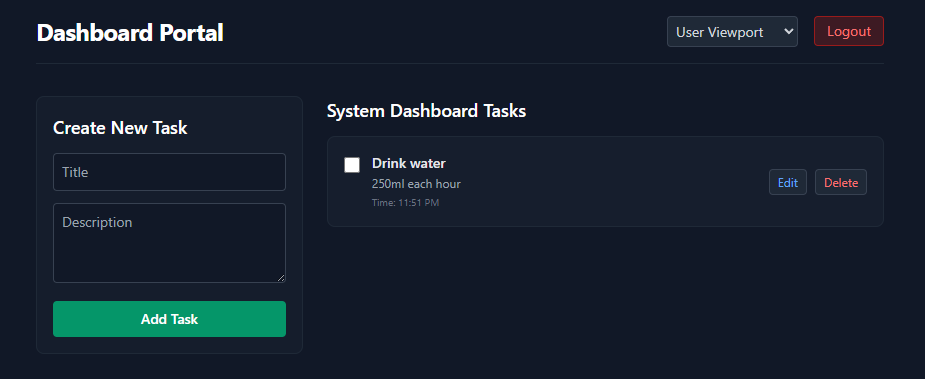
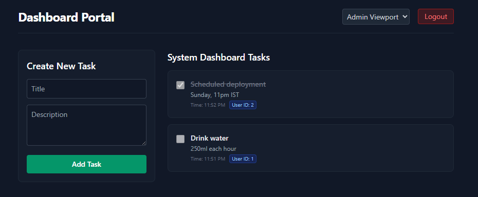
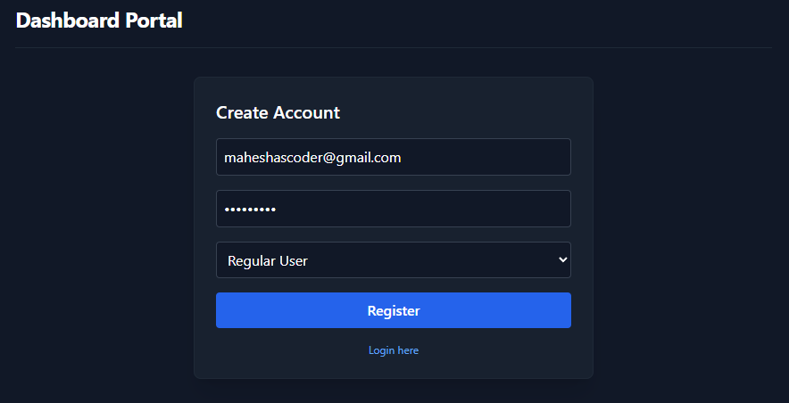

# Task Management Portal

## What is this about?
A simple, containerized task management app built. It includes a FastAPI backend, a React frontend, a PostgreSQL database, and Redis caching.

## Features & Tech Stack
* **Backend**: FastAPI (Python 3.11) with structural Pydantic validation schemas.
* **Frontend**: React.js with Vite and Tailwind CSS.
* **Database**: PostgreSQL 15 with SQLAlchemy ORM.
* **API Documentation**: Interactive **Swagger / OpenAPI UI** available natively out-of-the-box.
* **Role-Based Access Control (RBAC)**: Distinguishes regular `user` profiles from system `admin` views.
* **Authentication**: Short-lived stateless JWT Access Tokens paired with a stateful Redis-backed Refresh Token system.

## Additional Feature: Redis Caching
* **Read Optimization**: Caches task list fetches (`GET /api/v1/tasks`) in Redis to eliminate repetitive database queries.
* **Cache Eviction**: Task modifications (`POST`, `PUT`, `DELETE`) instantly clear out stale cache blocks.

## Setup Guide

Run this command from the root directory:

```bash
docker-compose up --build
```

## Screenshots

### User Dashboard


### Admin Viewport


### Swagger Interactive Docs
